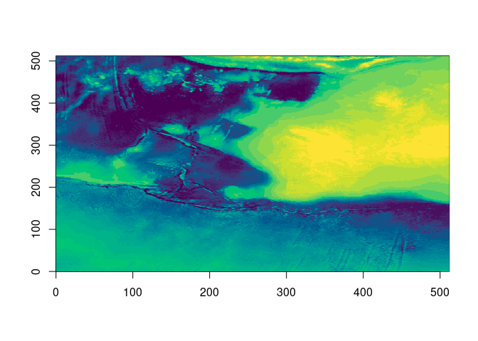

<!-- README.md is generated from README.Rmd. Please edit that file -->

# rustycogs

<!-- badges: start -->

[](https://github.com/hypertidy/rustycogs/actions/workflows/R-CMD-check.yaml)
[](https://app.codecov.io/gh/hypertidy/rustycogs?branch=main)

<!-- badges: end -->

Extract byte-range chunk references and decode tiles from cloud-hosted
TIFF and COG files, entirely from R, without Python or GDAL.

Uses Rust crates
[async-tiff](https://github.com/developmentseed/async-tiff) and
[object_store](https://docs.rs/object_store/) (Apache arrow-rs) for
async I/O across S3, GCS, Azure, HTTP, and local storage.

Three modes:

- **Inspect** (`tiff_ifd_info`): compact one-row-per-IFD structural
  summary
- **Scan** (`tiff_refs`): full per-tile byte-range references for
  Kerchunk/Zarr virtual stores
- **Decode** (`tiff_read_tiles`, `tiff_tile`, `tiff_tiles`): fetch and
  decompress pixel data

## Installation

Requires a Rust toolchain (`rustup`). See
`inst/design-docs/rust-setup.md` for guidance.

``` r
install.packages("rustycogs", repos = "https://hypertidy.r-universe.dev")
```

## Usage

### Inspect file structure

``` r
library(rustycogs)

# One row per IFD — fast way to understand a file before fetching tiles
tiff_ifd_info("https://projects.pawsey.org.au/idea-gebco-tif/GEBCO_2024.tif")
#   ifd is_tiled image_w image_h tile_w tile_h n_tiles_x n_tiles_y dtype compression
# 1   0     TRUE   86400   43200    512    512       169        85   <i2     Deflate
# 2   1     TRUE   43200   21600    512    512        85        43   <i2     Deflate
# ...
#   crs_epsg gdal_nodata    scale_x     scale_y origin_x origin_y
# 1     4326      -32767 0.00416667 0.00416667     -180       90
```

### Scan tile references

``` r
# Scan a COG — one row per tile per IFD
refs <- tiff_refs("s3://bucket/file.tif", region = "ap-southeast-2", anon = TRUE)

# Write to Parquet for large reference sets
arrow::write_parquet(refs, "references.parquet")

# Build Kerchunk V1 JSON — fill_value from gdal_nodata automatically
kc <- refs_to_kerchunk(refs)
jsonlite::write_json(kc, "references.json", auto_unbox = TRUE)
```

### Fetch and decode tiles

``` r
# From a refs data frame — multi-file, vectorized, list-column result
refs <- tiff_refs("scene.tif")
refs <- tiff_read_tiles(refs)
arrays <- lapply(refs$data, tile_to_array)

# Single file batch
tiles <- tiff_tiles("scene.tif", cols = 0:3, rows = rep(0L, 4))
arrays <- lapply(tiles, tile_to_array)

# Single tile
tile <- tiff_tile("scene.tif", col = 0L, row = 0L)
m <- tile_to_array(tile)
ximage::ximage(m)
```

### Kerchunk round-trip via GDAL

``` r
refs <- tiff_refs("https://example.com/big.tif")
jsonlite::write_json(refs_to_kerchunk(refs), "refs.json", auto_unbox = TRUE)
terra::rast("ZARR:refs.json")
```

## What comes back

### `tiff_ifd_info`

One row per IFD:

    path | ifd | is_tiled | image_w | image_h | tile_w | tile_h |
    n_tiles_x | n_tiles_y | dtype | compression | bits_per_sample |
    samples_per_pixel | photometric | predictor | planar_configuration |
    crs_epsg | gdal_nodata | scale_x | scale_y | origin_x | origin_y

### `tiff_refs`

One row per tile per IFD — all columns from `tiff_ifd_info` plus:

    tile_col | tile_row | offset | length

### `tiff_read_tiles`

`refs` with a `data` list-column appended. Each element is a numeric
vector of decoded pixel values in row-major order; pass to
`tile_to_array()` to get a matrix or array.

### `tiff_tile` / `tiff_tiles`

A list (or list of lists) with:

- `data`: numeric vector of decoded pixel values (row-major)
- `dim`: integer vector `c(height, width, bands)`
- `dtype`: numpy-style type string (`"<f4"`, `"<u2"`, etc.)

### Array convention

`tile_to_array()` returns a matrix filled `byrow = TRUE` — consistent
with row-major order from async-tiff and expected by `rasterImage()` and
`ximage()`. For a round-trip: `as.vector(t(m))` recovers the original
vector. Multi-band tiles: `aperm(a, c(2, 1, 3))` swaps spatial axes to R
column-major while keeping bands in the third position.

## A generic tile reader using gdalraster

The refs table contains everything needed to build a simple reader
without decoding in Rust — useful for formats or compressions not yet in
async-tiff:

``` r
library(rustycogs)
refs <- tiff_refs(
  "https://s3.ap-southeast-2.amazonaws.com/ausseabed-public-warehouse-bathymetry/L3/6009f454-290d-4c9a-a43d-00b254681696/Australian_Bathymetry_and_Topography_2023_250m_MSL_cog.tif",
  anon = TRUE
)

tile_via_vsi <- function(refs, idx = 1, dsn_prefix = "/vsicurl/") {
  r <- refs[idx, ]
  vsi <- new(gdalraster::VSIFile, paste0(dsn_prefix, r$path))
  vsi$seek(r$offset, gdalraster::SEEK_SET)
  bytes <- vsi$read(r$length)
  vsi$close()
  uncomp <- memDecompress(bytes, "gzip")
  readBin(uncomp, "numeric", n = r$tile_w * r$tile_h, size = r$bits_per_sample / 8)
}

tail(refs[, 2:6], 5)
#>      ifd tile_col tile_row   offset length
#> 3491   4        3        2 10873651 445133
#> 3492   5        0        0    44388 920443
#> 3493   5        1        0   964839 906069
#> 3494   5        0        1  1870916 234626
#> 3495   5        1        1  2105550 234953
tilevals <- tile_via_vsi(refs[nrow(refs) - 3, ])
ximage::ximage(
  matrix(tilevals, 512L, byrow = TRUE),
  col = hcl.colors(24),
  breaks = quantile(tilevals, seq(0, 1, length.out = 25))
)
```



## Related

- [vapour](https://github.com/hypertidy/vapour) — GDAL-based
  raster/vector reading
- [grout](https://github.com/hypertidy/grout) — tile scheme calculations
- [gdalraster](https://github.com/USDAForestService/gdalraster) — GDAL
  bindings for R
- [async-tiff](https://github.com/developmentseed/async-tiff) — the Rust
  crate
- [virtual-tiff](https://github.com/virtual-zarr/virtual-tiff) — Python
  equivalent

## Code of Conduct

Please note that the rustycogs project is released with a [Contributor
Code of
Conduct](https://contributor-covenant.org/version/2/1/CODE_OF_CONDUCT.html).
By contributing to this project, you agree to abide by its terms.
